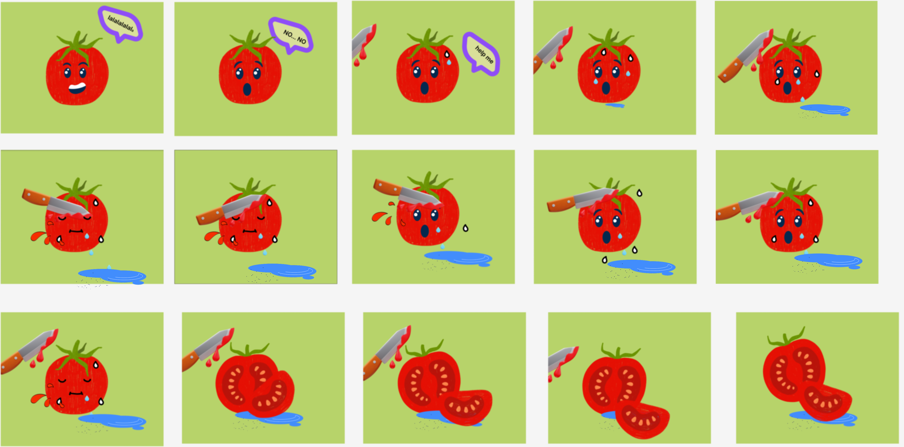

# 🍅 Tomato Crying Animation — Figma Prototype

This repository showcases a **Figma animation prototype** where a tomato sheds tears when it's cut.  
It's a playful and expressive animation designed to demonstrate emotional storytelling in UI/UX design.

---

## 🎨 Design Preview

> Currently, only a static image is submitted to showcase the concept.  
> The interactive Figma prototype can be viewed here:  
> [View Figma Prototype](https://www.figma.com/design/gKFMu1cvuxyQO2FeEbYaYu/animation-try?node-id=0-1&t=cghTDreDOyfQSxk3-1)

---

## 📬 Author

**Anusree**  
**GitHub:** [@ANUSREES-GIT](https://github.com/ANUSREES-GIT)
